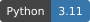
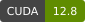
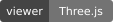
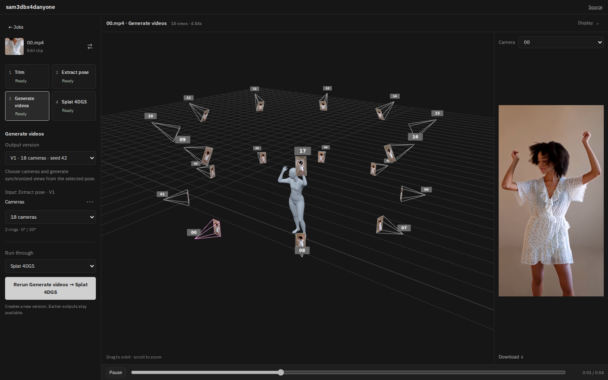

# sam3dbx4danyone

[](LICENSE)
[](docs/THIRD_PARTY_NOTICES.md#default-wan22-ti2v-5b-turbo-lora)
[](pyproject.toml)
[](wheels/README.md)
[](docs/ui.md)

Generate synchronized multi-view videos from one person's input video using **SAM 3D Body + BiRefNet, four-step Turbo, and the full Wan VAE**, then train an animated Gaussian scene with **FreeTimeGsVanilla**. This project adapts [4DAnyone](https://github.com/ant-research/4DAnyone) with a SAM 3D Body preprocessing pipeline, a GPU job queue, and an interactive Three.js viewer.



*The current viewer with an 18-camera generated result and its fitted SAM 3D Body mesh.*

**Topics:** `sam-3d-body` · `birefnet` · `4danyone` · `multi-view-video` · `human-motion` · `threejs` · `4d-gaussian-splatting` · `freetimegs`

- Upload, trim with chunk snapping, choose 1×–4× speed, and generate 121-frame chunks.
- Choose 6, 8, 12, 16, 18, 24 or 36 cameras with predefined elevation rings.
- Inspect synchronized camera videos and the animated body mesh in 3D.
- Browse and delete completed results in the gallery; process independent chunks across available GPUs.
- Train foreground 4D Gaussian scenes with live previews and playback in the same 3D viewer.
- Download compact TSOG scenes with the source audio trimmed and sped up to match each chunk.

Choose calibrated multi-view videos or a trained foreground 4D Gaussian scene. Each chunk generates and trains independently; scenes are not stitched across chunks. Expanded Turbo layouts and reconstruction quality remain experimental.

The default `full` mode keeps BF16 model weights, FP32 denoising state and lossless RGB output under a **23 GiB per-process limit**. SageAttention, bounded attention compilation, CPU thread budgeting and persistent GPU workers are enabled by default on the validated L40S setup. There is no tiny-VAE or FP8 path.

## Setup

Python 3.11, NVIDIA CUDA GPUs, and `uv` are required. The bundled SageAttention wheel targets Linux x86_64, Torch 2.8/CUDA 12.8 and L40S; see [wheel compatibility](wheels/README.md) for other hardware.

```bash
git clone --recurse-submodules https://github.com/OpsiClear-4DGS/sam3dbx4danyone.git
cd sam3dbx4danyone
uv sync --extra trt
.venv/bin/python scripts/download_model.py --turbo=True
.venv/bin/python scripts/download_example.py
.venv/bin/python scripts/build_trt_engines.py --precision=fp16
```

Missing pinned models download automatically when needed. TensorRT engines are built and validated locally for the installed GPU/toolchain. The default `motion_backend=auto` uses validated engines when available and otherwise falls back to CUDA ONNX Runtime. Use `--motion_backend=tensorrt` to require TensorRT. Engines can be rechecked with `scripts/validate_trt_engines.py --precision=fp16`.

For 4DGS training, initialize the pinned [FreeTimeGsVanilla submodule](third_party/FreeTimeGsVanilla) and its separate environment:

```bash
git submodule update --init --recursive
uv sync --locked --project third_party/FreeTimeGsVanilla
npm ci --ignore-scripts --prefix third_party/tsog
npm run build --prefix third_party/tsog
```

Training uses Python 3.12 and the submodule's dependencies; generation stays on Python 3.11 / NumPy 2. TSOG packaging requires Node.js 22+, WebGPU/Vulkan and FFmpeg for source audio. To reuse an existing training environment, set `FDANYONE_FREETIMEGS_PYTHON=/absolute/path/to/FreeTimeGsVanilla/.venv/bin/python`. See [training setup and data contract](docs/training.md).

## Interactive UI

```bash
uv sync --extra trt --extra gui
.venv/bin/python app.py
```

Open `http://127.0.0.1:8080` to upload a video, trim and speed it up, split it into chunks, choose cameras, run the chunks across GPUs and inspect results in the Three.js camera scene adapted to SAM 3D Body. The interface uses plain HTML/JavaScript and FastAPI, with no Gradio. See [UI usage](docs/ui.md) for remote access and saved results.

Adding a video creates a persistent job with **Trim → Extract pose → Generate videos → Splat 4DGS**. Configure each step, choose a start step and **Run through** a later step, or run only the selected step. Every run keeps its settings and input versions; camera changes reuse pose, and training changes reuse videos. Click a gallery result to reopen its task panel while idle.

With the training environment installed, the default end step is **Splat 4DGS**. Training preserves soft foreground alpha, uses explicit opacity supervision and matching random backgrounds, and streams model previews into the existing viewer about every 30 seconds. Playback, cameras and body mesh share one timeline; **Display** controls visibility, audio and TSOG download. Choose **Generate videos** as the last step to stop before training. CLI generation remains opt-in for training:

```bash
.venv/bin/python inference.py --video_path=video.mp4 --train_4dgs=True
# Or train an existing result without generating its videos again:
.venv/bin/python train_4dgs.py --result_dir=data/fdanyone/video
```

## Generate on every GPU

```bash
.venv/bin/python batch_inference.py \
  --video_paths='["data/source/pexels/5885633-hd_1080_1920_25fps.mp4","data/source/pexels/2785536-uhd_2160_3840_25fps.mp4"]' \
  --output_dir=outputs/full-mode-videos
```

Each visible GPU processes one input video at a time and takes the next queued job when finished. Workers reuse the loaded denoiser and compiled code. With fewer jobs than GPUs, only the needed GPUs run. `CUDA_VISIBLE_DEVICES` limits the pool. See [GPU queues](docs/multi_stream.md).

For a single input:

```bash
.venv/bin/python inference.py \
  --video_path=data/source/pexels/5885633-hd_1080_1920_25fps.mp4 \
  --gpu_ids='[0]' \
  --data_dir=outputs/full-mode-single
```

Inputs need at least 121 usable frames, one foreground person and a mostly stationary camera. Portrait 9:16 footage at 720p or higher is preferred. SAM body predictions are per frame; there is no temporal refinement.

## Camera layouts and settings

- Six views in one ring are the default.
- `--views_per_layer=24` enables the experimental 24-camera Turbo ring. Direct `inference.py` uses all visible GPUs unless `--gpu_ids` restricts them. Batch jobs remain on one GPU each. See [24-camera usage](docs/turbo_24_cameras.md).
- `--turbo=False` selects Base generation for other camera layouts and quality comparisons. Base uses 24 denoising steps.
- `--layer_pitches`, `--start_yaw`, and `--yaw_span` control the rig. Base view counts must be divisible by four or six.
- `--execution_profile=full` is the default and only production profile. `quality` is a compatibility alias.
- `--compile_dit=False` selects the eager reference. Compilation automatically falls back when less than 23 GiB is free at startup.
- `--motion_precision=fp16` is the validated TensorRT default; `fp32` remains available for comparison.

Run `inference.py --help` or `batch_inference.py --help` for all arguments.

## Outputs and measured performance

Each result contains `metadata.json`, `cameras.json`, preprocessing geometry, skeleton videos and generated views under `videos/dense/`. Videos contain 121 frames at 704×1280 and the selected frame rate. Lossless RGB originals preserve VAE output bytes; the UI creates separate H.264 playback copies for browsers. See [output format](docs/output.md).

| Validated run | Complete pipeline | Peak process VRAM |
|---|---:|---:|
| Six views, one L40S | 7m03s | 20.71 GiB |
| 24 cameras, seven L40S GPUs available | 7m26s | 21.21 GiB |

These are generation-only runs, not throughput guarantees; they exclude foreground dataset preparation and 4DGS training. Full-VAE decoding remains the largest single-GPU generation stage. See [performance and validation limits](docs/performance.md) and [training](docs/training.md).

## Maintenance

```bash
.venv/bin/python -m unittest discover -s tests
```

The active scripts cover model/example downloads and TensorRT build/validation. Model weights, uploads, generated results and local caches are ignored by Git. The Python import package remains `fdanyone` for compatibility with the upstream pipeline.

## License and attribution

This adaptation and its original additions and modifications use **[GNU AGPL-3.0-only](LICENSE)**. Inherited 4DAnyone code retains its [Apache-2.0 license](third_party/licenses/4DANYONE_LICENSE) and attribution. Third-party components keep their own licenses.

The default Turbo adapter uses **CC BY-NC-SA 4.0 (noncommercial)**; SAM 3D Body, DINOv3, schema material and NVIDIA components retain separate terms. Changing this project's code license does not relicense model weights or dependencies. See the [current license notices](docs/THIRD_PARTY_NOTICES.md) and bundled license texts.

The UI's **Source** link offers this project's corresponding source. Deployments with further modifications must offer the corresponding source for the version they serve, as required by AGPL section 13.

Based on [4DAnyone](https://github.com/ant-research/4DAnyone), [project page](https://4danyone.github.io/) and [paper](https://arxiv.org/abs/2608.20335). Retained third-party code and model terms are documented in [third-party notices](docs/THIRD_PARTY_NOTICES.md).

```bibtex
@article{jin2026fdanyone,
  title={4DAnyone: Create Anyone in 4D from a Casual Monocular Video},
  author={Jin, Yudong and Xie, Tao and Zhang, Qihang and Shen, Zehong and Xu, Zhen and Shen, Yujun and Bao, Hujun and Zhou, Xiaowei and Xu, Yinghao},
  journal={arXiv preprint arXiv:2608.20335},
  year={2026},
  url={https://arxiv.org/abs/2608.20335}
}
```
